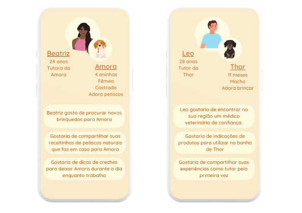
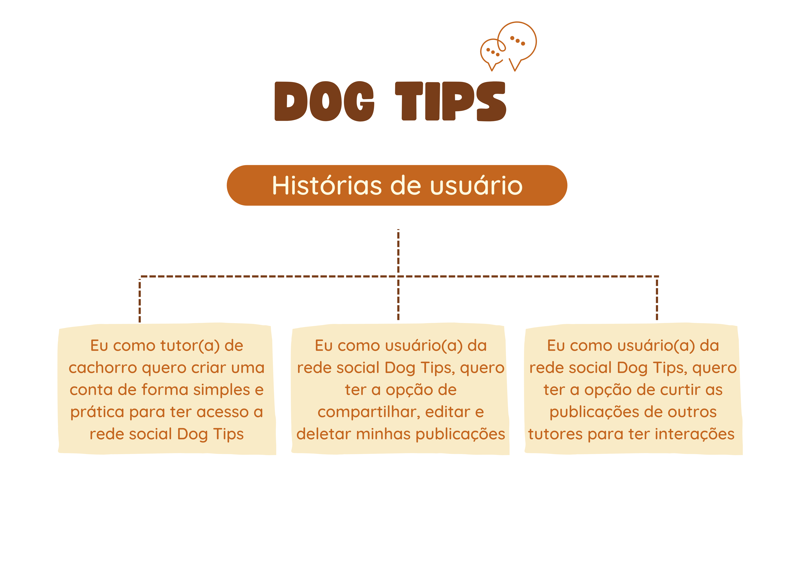
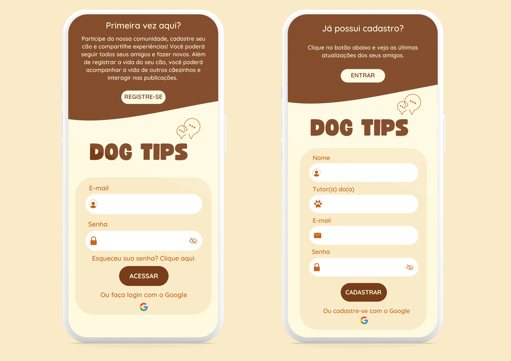
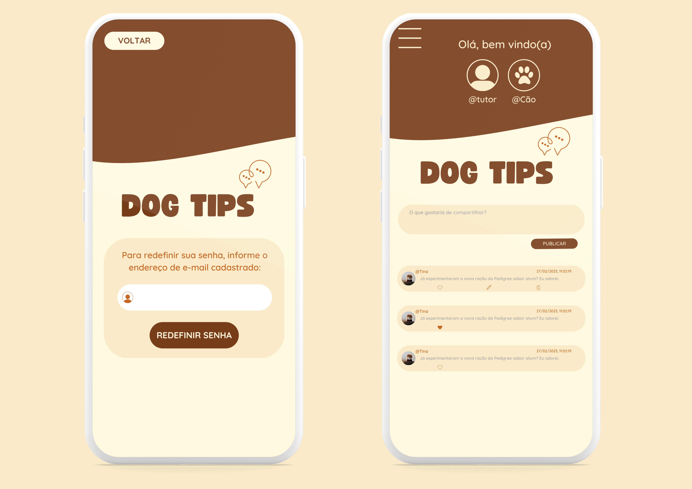
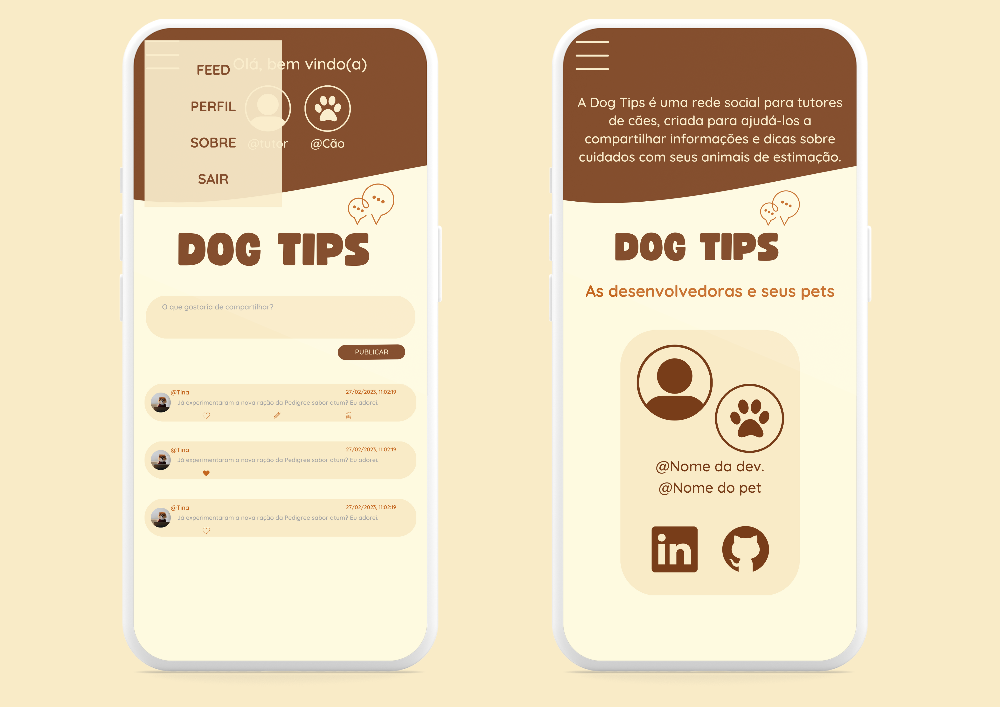
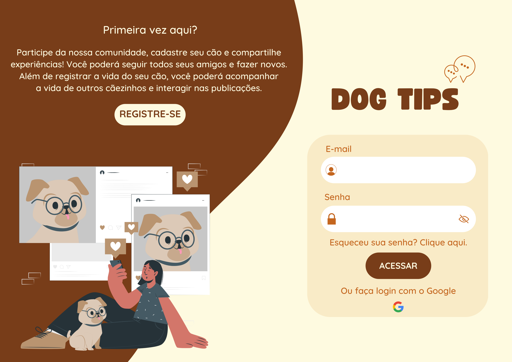
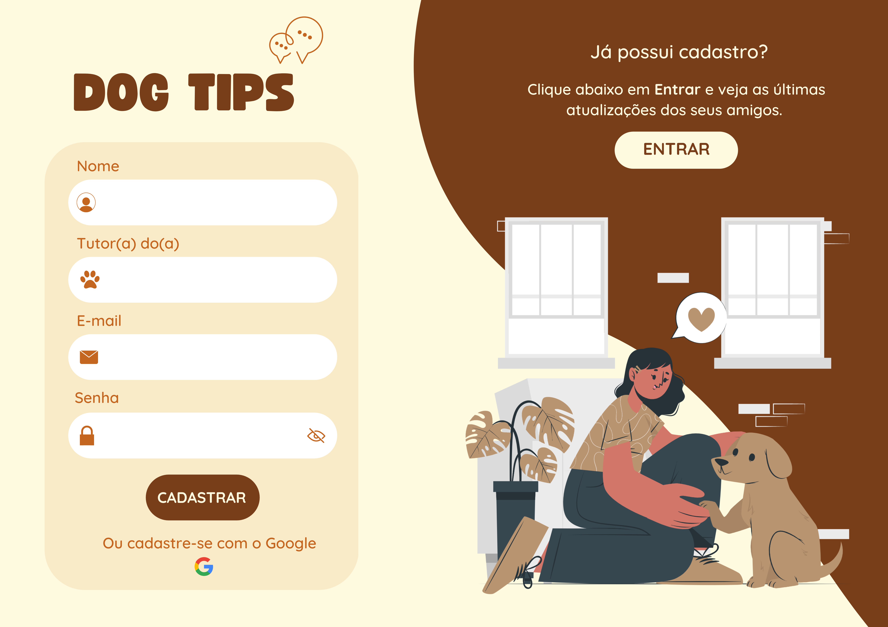
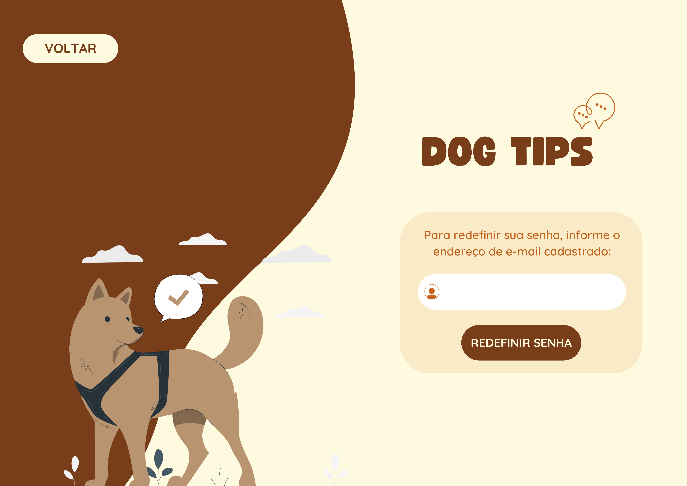
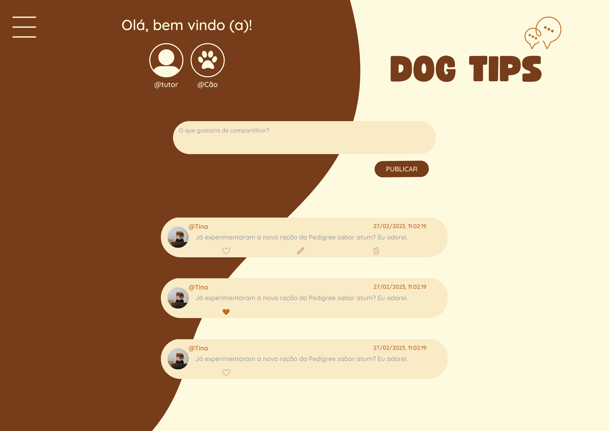

## :round_pushpin: Índice

- [:round\_pushpin: Índice](#round_pushpin-índice)
- [1. Sobre o Projeto :computer: :dog:](#1-sobre-o-projeto-computer-dog)
- [2. Nossos Usuários 👩🏽‍💻👨🏽‍💻](#2-nossos-usuários-)
- [3. Histórias de Usuários :book:](#3-histórias-de-usuários-book)
- [4. Protótipos para Mobile 📱](#4-protótipos-para-mobile-)
- [5. Protótipos para Desktop :computer:](#5-protótipos-para-desktop-computer)
- [5. Conteúdos Abordados 🎯](#5-conteúdos-abordados-)
  - [HTML e CSS](#html-e-css)
  - [DOM e Web APIs](#dom-e-web-apis)
  - [Javascript](#javascript)
  - [Firebase](#firebase)
  - [Testing](#testing)
  - [Git e Github](#git-e-github)
- [6. Ferramentas utilizadas 🔧](#6-ferramentas-utilizadas-)
- [7. Desenvolvedoras 👩🏻‍💻 👷🏻‍♀️](#7-desenvolvedoras--️)
  - [👩🏻‍🎨 Ana Paula](#-ana-paula)
  - [👩🏻‍🎨 Paola Oliveira](#-paola-oliveira)
  - [👩🏻‍🎨 Thainara Tabile](#-thainara-tabile)

## 1. Sobre o Projeto :computer: :dog:

A rede social Dog Tips surgiu da necessidade de uma de nossas integrantes, que se mudou para uma nova cidade com seu cão diagnosticado com otite e não sabia onde encontrar ajuda. Como resultado, criamos uma plataforma onde tutores de cães possam compartilhar experiências, dicas, vivências e aprendizados uns com os outros. 

Nosso projeto Social Network foi desenvolvido durante o bootcamp da [Laboratória](https://www.laboratoria.la/br), onde aprimoramos habilidades em autenticação com Firebase Auth, persistência de dados com Firestore e fomos apresentadas ao conceito de SPA (Single Page Application).

A Dog Tips é uma rede social específica para tutores de cães, com o objetivo de conectar pessoas que compartilham do amor por esses animais de estimação. Além disso, a plataforma visa ajudar os usuários a encontrar informações úteis sobre cuidados com seus cães e recomendações de lugares que possam ser úteis para o bem-estar de seus animais.

Através da Dog Tips, os usuários podem criar perfis, compartilhar informações, curtir e descurtir publicações, e ter acesso a conteúdos exclusivos relacionados ao universo canino. Com isso, esperamos criar uma comunidade forte e colaborativa que possa auxiliar os tutores de cães em suas necessidades e proporcionar um ambiente seguro e acolhedor para seus usuários.

## 2. Nossos Usuários 👩🏽‍💻👨🏽‍💻
Para o desenvolvimento de produtos e interfaces digitais voltados para a experiência do usuário (UX), é fundamental adotar uma abordagem centrada no usuário, que leve em consideração as necessidades e desejos dos donos de cachorros. Nesse sentido, a criação de personas é uma estratégia eficaz para compreendermos melhor quem são nossos usuários.

Por meio da criação de personas, podemos estabelecer perfis fictícios que representem os diferentes tipos de donos de cachorros que utilizam nossos produtos. Esses perfis incluem informações relevantes, como idade, gênero, profissão, estilo de vida, preferências, objetivos e desafios relacionados à criação de seus animais de estimação.

Com base nesses perfis, conseguimos guiar as tomadas de decisão do projeto, desenvolvendo soluções que atendam às necessidades específicas de cada tipo de usuário. Isso nos ajuda a criar produtos e interfaces digitais mais intuitivos, funcionais e eficientes, que proporcionem uma experiência satisfatória aos donos de cachorros que os utilizam.

## 3. Histórias de Usuários :book: 
Após termos compreendido melhor as necessidades de nossos usuários, determinamos as Histórias de Usuário que representam suas necessidades na Rede Social.

## 4. Protótipos para Mobile 📱
<h5>📌 Tela de Login e de Cadastro</h5>

<h5>📌 Tela de Redefinir Senha e Feed</h5>

<h5>📌 Feed (Menu) e página Sobre</h5>

## 5. Protótipos para Desktop :computer: 
<h5>📌 Tela de Login</h5>

<h5>📌 Tela de Cadastro</h5>

<h5>📌 Tela de Redefinir Senha</h5>

<h5>📌 Feed</h5>

## 5. Conteúdos Abordados 🎯

O objetivo principal de aprendizagem deste projeto foi construir uma [Single-page Application
(SPA)](https://pt.wikipedia.org/wiki/Aplicativo_de_p%C3%A1gina_%C3%BAnica) [responsiva](../../topics/css/02-responsive) (com mais de uma tela/ página) na qual seja possível *ler e escrever dados.*

### HTML e CSS

- [HTML
      semântico](https://developer.mozilla.org/pt-BR/docs/Glossario/Semantica)
- [CSS `flexbox`](https://css-tricks.com/snippets/css/a-guide-to-flexbox/)

### DOM e Web APIs

- [Manipulação do
      DOM](https://developer.mozilla.org/pt-BR/docs/DOM/Referencia_do_DOM/Introdu%C3%A7%C3%A3o)
- [History
      API](https://developer.mozilla.org/pt-BR/docs/Web/API/History_API)
- 
  [`localStorage`](https://developer.mozilla.org/en-US/docs/Web/API/Window/localStorage)

### Javascript

- [Uso de
      callbacks](https://developer.mozilla.org/pt-BR/docs/Glossario/Callback_function)
- [Consumo de
      Promises](https://scotch.io/tutorials/javascript-promises-for-dummies#toc-consuming-promises)
- Uso de ES modules
      ([`import`](https://developer.mozilla.org/en-US/docs/Web/JavaScript/Reference/Statements/import)
      |
      [`export`](https://developer.mozilla.org/en-US/docs/Web/JavaScript/Reference/Statements/export))

### Firebase

- [Firestore](https://firebase.google.com/docs/firestore)
- [Firebase Auth](https://firebase.google.com/docs/auth/web/start)

### Testing

- [Teste unitários](https://jestjs.io/docs/pt-BR/getting-started)
- [Testes assíncronos](https://jestjs.io/docs/pt-BR/asynchronous)
- [Mocking](https://jestjs.io/docs/pt-BR/manual-mocks)

### Git e Github

- [Colaboração pelo Github](https://docs.github.com/pt/github/setting-up-and-managing-your-github-user-account/managing-access-to-your-personal-repositories/inviting-collaborators-to-a-personal-repository)
- [Organização pelo Github](https://docs.github.com/en/issues/organizing-your-work-with-project-boards/managing-project-boards/about-project-boards)

## 6. Ferramentas utilizadas 🔧

  
  
  
  
  
  
   
   
  
  
  

  ## 7. Desenvolvedoras 👩🏻‍💻 👷🏻‍♀️

### 👩🏻‍🎨 Ana Paula 
[GitHub](https://github.com/paulajanu) | [LinkedIn](https://www.linkedin.com/in/ana-paula-413517259/)

### 👩🏻‍🎨 Paola Oliveira
[GitHub](https://github.com/paola-oliveira) | [LinkedIn](https://www.linkedin.com/in/paola-natalia-oliveira-440969150/)

### 👩🏻‍🎨 Thainara Tabile
[GitHub](https://github.com/ThainaraTabile) | [LinkedIn](https://www.linkedin.com/in/thainaratabile/)