## 
 💻 📱 CRIANDO UMA REDE SOCIAL 📱 💻 

# 
 🪃 QA: Qualidade de Ações - Incentivando a prática de atividade física 🧡🏀 

 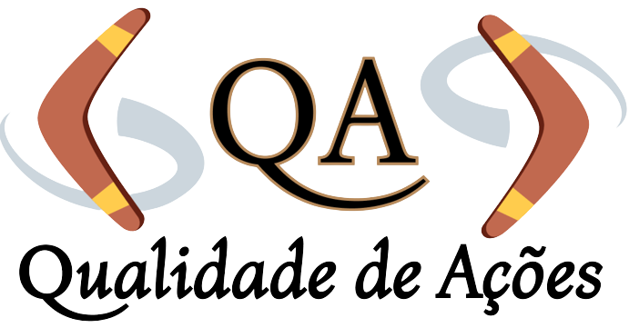

_"A sua **qualidade de vida** é como um bumerangue, precisa ter **movimento**. Todas as **ações** que você lançar, **voltarão** em sua direção ainda mais fortes."_ 

 _Melhore suas ações, pratique atividade física!_

### Acesse o projeto completo [CLICANDO AQUI](https://THALINascimento.github.io/SAP009-social-network/) 

***

## Resumo do projeto

Neste projeto, construímos uma Rede Social sobre melhoria da qualidade de vida, com foco na prática de atividade física. Nela, permitimos à qualquer usuário **criar uma conta** de acesso, **logar-se** com ela (utilizando email e senha cadastrados ou conta do Google), criar, editar, deletar e dar _likes_ em **publicações**. Para essas finalidades, utilizamos o **Firebase**. Ele é um conjunto de serviços de computação em nuvem de back-end e plataformas de desenvolvimento de aplicativos, fornecidos pelo Google. O objetivo principal de aprendizagem deste projeto foi construir uma Single-page Application **(SPA) responsiva**, na qual aplicamos o conceito de **Mobile-First**, com mais de uma tela/página onde fosse possível **ler e escrever dados**. 
  
***

## DEFINIÇÃO DO PRODUTO

* Objetivo principal
• Proporcionar a melhoria da qualidade de vida, através do aumento de bem-estar físico.

* Objetivos secundários:
• Despertar para a importância da ação, do movimento.
• Incentivar a prática de atividade física, com foco no bem-estar físico.
• Compartilhar conhecimento sobre os pilares da qualidade de vida.
• Garantir a compreensão de que a melhoria do bem estar-físico gera consequentemente a
melhoria dos outros pilares.

**Público-alvo**: Iniciantes (ou interessados a iniciar) a prática de atividade física.

Em nossa rede social, para ser possível a interação do usuário, é necessário que o    mesmo esteja realmente interessado em aprimorar a qualidade das suas ações! 

**Como assim?** É simples, esta rede social vai além de conectar usuários que
sejam realmente iniciantes da prática de algum tipo de atividade física e que
compartilham os objetivos acima, principalmente o de melhorar a qualidade de vida. 
Para ser um usuário ativo que pode interagir com os outros usuários, pulicar e editar posts, dar e remover likes, é **INDISPENSÁVEL** que o mesmo disponha de **AÇÃO**,      
de movimento fora do ambiente virtual.

**E como faremos isso?** Primeiro, é necessário o interesse de melhorar a
qualidade de vida. Segundo, precisa ter iniciado a pouco tempo, ou pretenda iniciar
a prática de atividade (independente de qual). E terceiro, e mais importante, todas as publicações devem ser realizadas somente após o movimento ter sido feito. Ou seja, 
somente após o usuário ter realizado o aprimoramento na qualidade de suas ações diárias, 
é que o mesmo deverá publicar na sua linha do tempo, e visualizar e interargir com as
publicações de outros usuários.

**De que forma poderá ser feito?**
O usuário poderá realizar publicações sobre a ação que realizou naquele dia:
• Qual foi a atividade física.
• As características da atividade (local, duração, intensidade).
• Quais melhorias a prática trouxe para seu bem-estar físico.
• Quais melhorias a prática trouxe para os outros pilares da vida (sono,
humor, saúde mental, relacionamentos social /familiar / profissional).

**De que forma acontecem as interações?**

O usuário poderá visualizar outras publicações e reagir sobre elas!

• Poderá curtir a prática realizada por outro usuário (💛)
• Poderá reagir se a prática realizada foi a mesma que a dele (🤝)
• Poderá reagir se a melhoria do bem-esta físico foi a mesma que a dele (😉)
• Poderá reagir se a melhoria dos outros pilares foi a mesma que a dele, sendo:
• Melhoria do sono (😴)
• Melhoria do humor (😁)
• Melhoria da saúde mental (💆)

***

## HISTÓRIAS DOS USUÁRIOS

Elaboramos seis histórias baseadas na escolha do público-alvo para elucidar os usuários em
potencial e entender o fluxo de interações que os mesmos desejam executar. Após a compreensão da necessidade de cada um, todas foram estruturadas no projeto desenvolvido.

 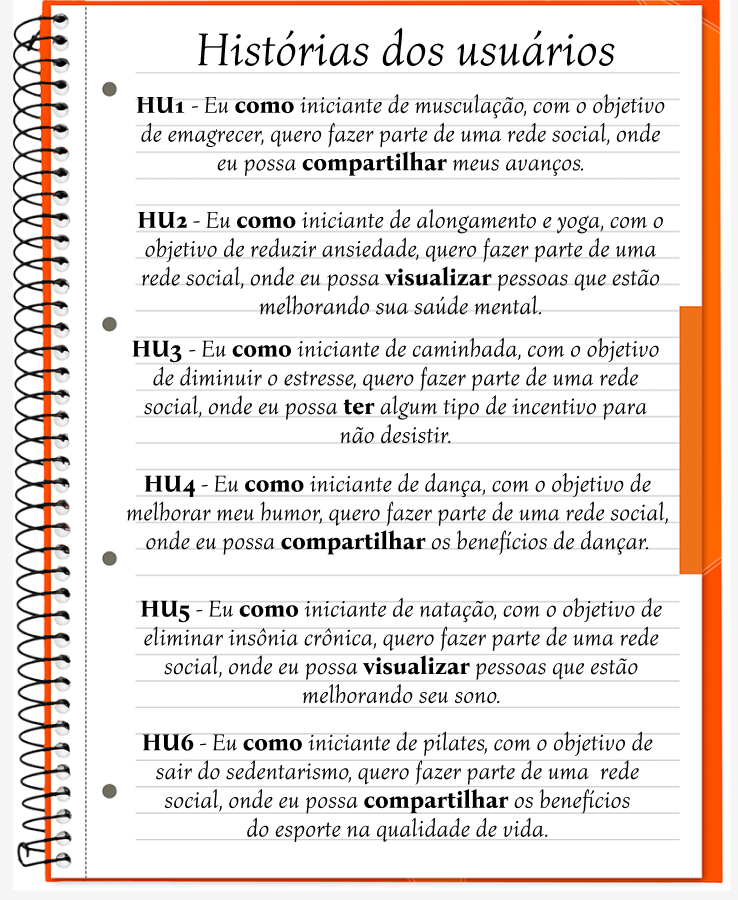 
 

## Nível de EXPERIÊNCIA e INTERFACE 

A interface do usuário (UI), ou seja, a parte visual desse projeto, foi pensada
com base no nosso público-alvo, e também no tema abordado. Atráves da psicologia 
das cores, fizemos uma pesquisa do efeito das cores no cérebro, e de acordo com os
resultados, foram escolhidas as cores laranja e cinza. A primeira cor, laranja, 
representa confiança, otimismo e animação. O efeito dessa cor estímula o entusiasmo energia e alegria. E o cinza, representa segurança, confiabilidade, maturidade e estabilidade. O efeito dessa cor coordena as emoções, ou seja, é a expressão da 
neutralidade. Isso significa que essa cor gera equilíbrio. Sendo assim, a paleta 
abaixo foi escolhida para estabelecer a comunicação visual entre os usuários e as 
páginas. Tanto a interface, quanto a experiência do usuário (UX), foram pensadas e
baseadas atráves de protótipos de baixa e alta fidelidades, ambos construídos no figma.

 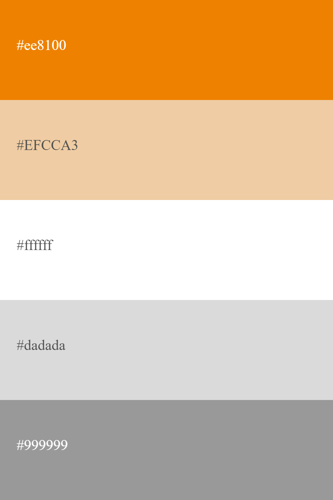 

## PROTÓTIPO DE BAIXA FIDELIDADE:

Nesta interface, aplicamos o conceito de Mobile-first. Definimos qual seria o fluxo 
que o usuário seguiria dentro da nossa rede e, com isso, criamos a interface do usuário (UI), que seguisse este fluxo. Desenhamos a ideia do posicionamento de cada elemento nas páginas, uma a uma, de maneira simples, com baixo grau de detalhamento, e os identificamos.

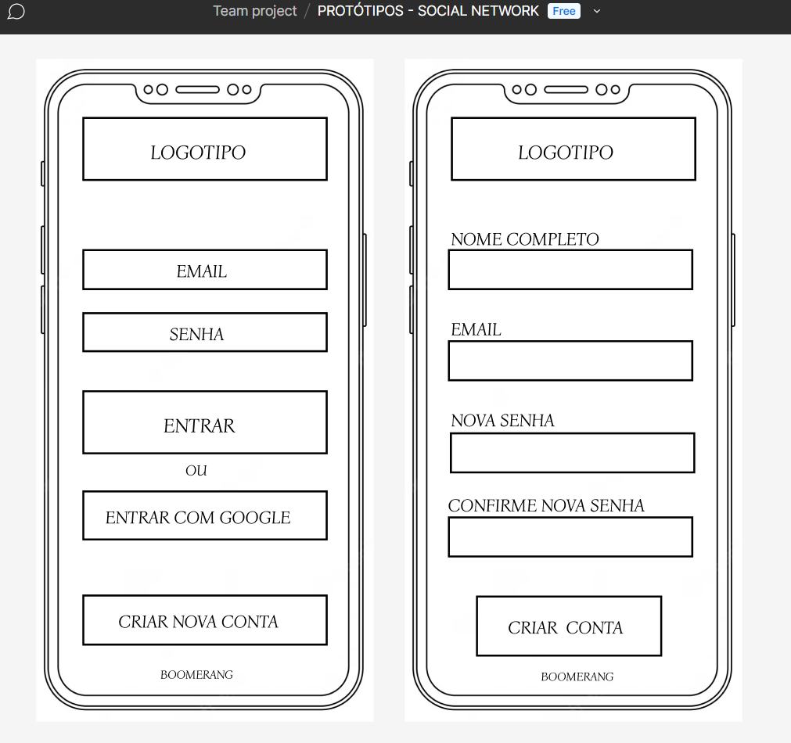 
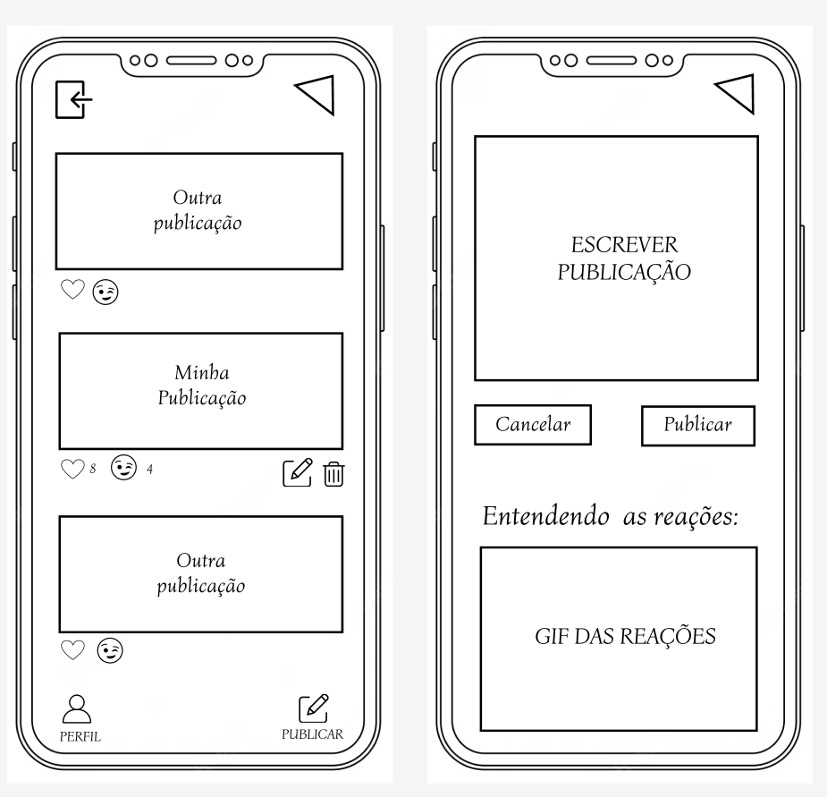 

## PROTÓTIPO DE ALTA FIDELIDADE MOBILE:

Nesta interface, criamos dois prótotipos: Mobile e Desktop. No primeiro, aplicamos
o posicionamento de cada elemento, pigmentamos com a palheta de cores escolhida,
desenhamos com alto grau de detalhamento, apresentamos visualmente a funcionalidade
e reproduzimos fielmente o produto final em termos de design.

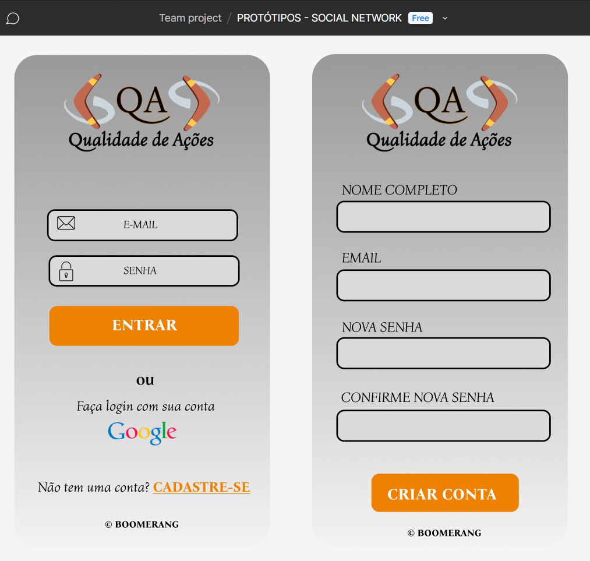 
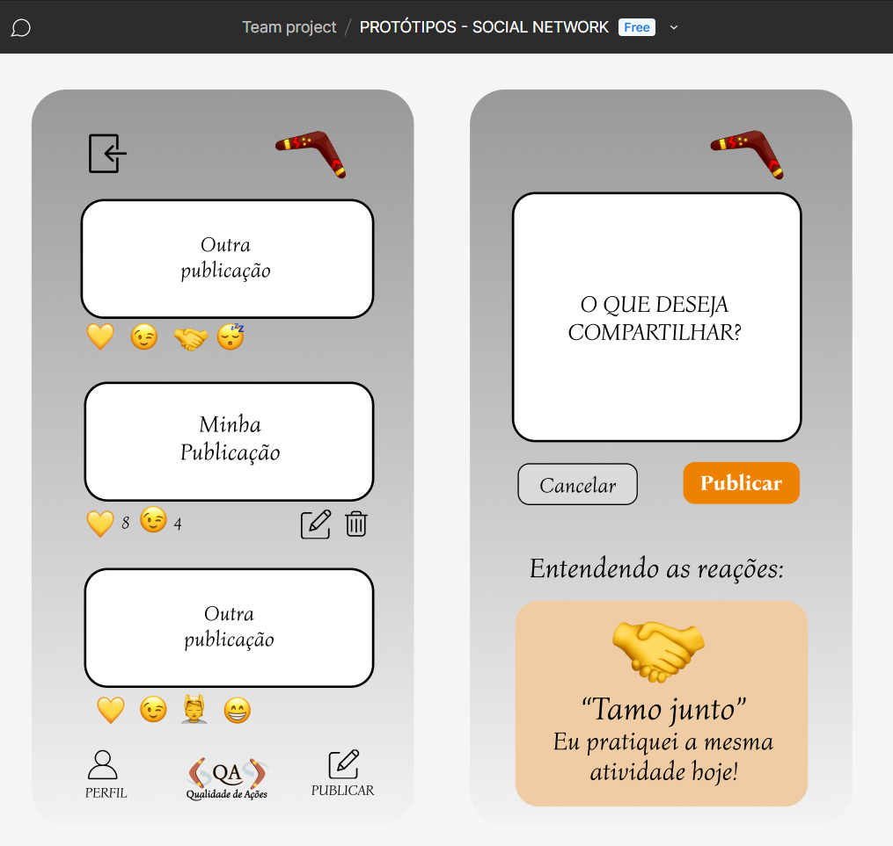 

## PROTÓTIPO DE ALTA FIDELIDADE DESKTOP:

Já no desktop, além do que já foi citado acima, também adptamos alguns elementos de
nossas páginas para telas maiores, de acordo com os desenhos abaixo:

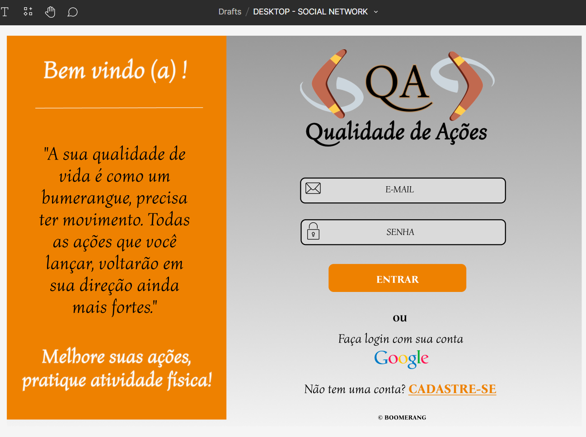 
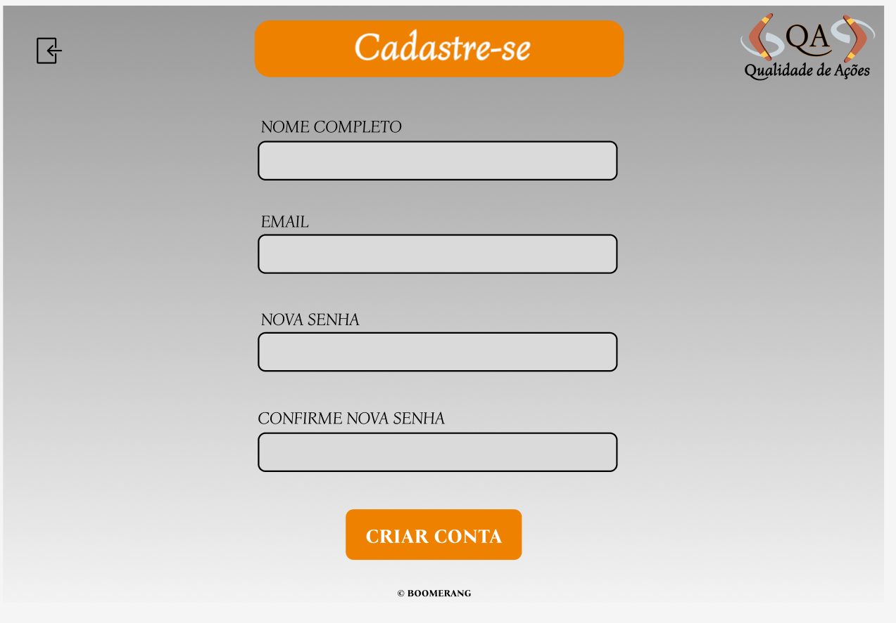 
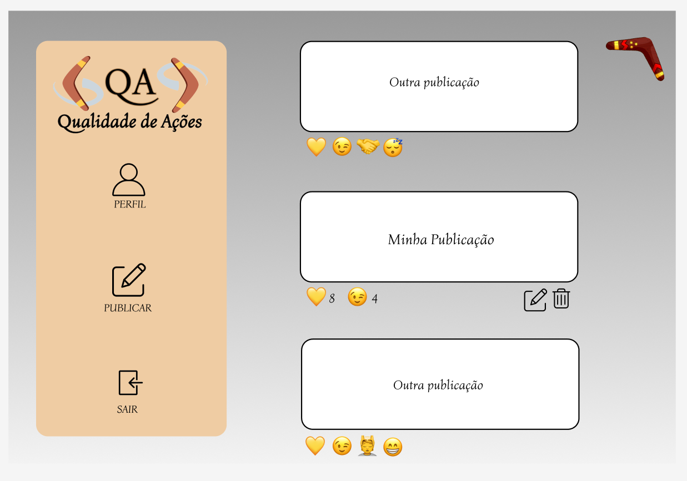 
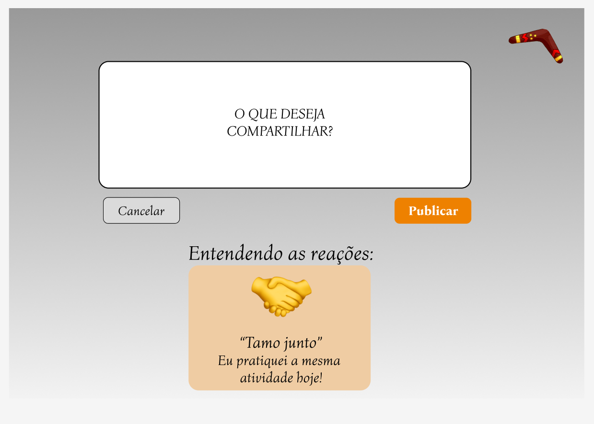 

## Testes de usabilidade:

Utilizamos estratégias para garantir uma usabilidade de qualidade em nosso aplicativo.
Sendo assim, aplicamos uma identidade clara, boa acessibilidade, fácil navegação, 
design limpo e atraente, é responsivo, e, incentiva a interação. Pensando na usabilidade 
do nosso aplicativo e na experiência do usuário (UX), criamos protótipos que otimizassem
a navegação: Menu na barra inferior, botões de confirmação em destaque e próximos ao polegar direito. Botões de logout na barra superior e no canto esquerdo. 

Realizamos sessões de teste de usabilidade com usuários diferentes, com o produto em HTML. 
Através dos resultados obtidos, iteramos nossos desenhos de interface, aplicando modificação da fonte, principalmente tamanho e destaque. Reposicionamento de alguns elementos, e a melhoria dos botões.

***

## E quais objetivos foram alcançados neste projeto?

(🪃) Ser uma SPA.
(🪃) Ser _responsivo_.
(🪃) Fazer _tests_ unitários.
(🪃) Fazer testes manuais buscando erros e imperfeições simples.
(🪃) Fazer testes de usabilidade e incorporar o _feedback_ dos usuários como
melhorias.

#### Criação e login de conta de usuário

* _Login_ com Firebase:
(🪃) Para o _login_ e postagens na timeline, utilizamos o Firebase.
(🪃) O usuário deve poder criar uma conta de acesso ou autenticar-se com conta de
    e-mail e senha e também com uma conta do Google.
* Validações:
(🪃) Somente usuários com contas válidas têm acesso permitido.
(🪃) Não haver usuários repetidos.
(🪃) O que o usuário digita no campo de senha (_input_) deve ser secreto.
* Comportamento:
(🪃) Quando o formulário de registro ou login é enviado, ele deve ser validado.
(🪃) Se houver erros, mensagens descritivas devem ser exibidas para ajudar o
    usuário.

#### Timeline/linha do tempo

* Validações:
(🪃) Ao publicar, deve ser validado se há conteúdo no _input_.
* Comportamento:
(🪃) Ao recarregar o aplicativo, é necessário verificar se o usuário está
    _logado_ antes de exibir o conteúdo.
(🪃) Conseguir publicar um _post_.
(🪃) Poder dar e remover _likes_ em uma publicação. Máximo de um por usuário.
(🪃) Visualizar contagem de _likes_.
(🪃) Poder excluir uma postagem específica.
(🪃) Solicitar confirmação antes de excluir um _post_.
(🪃) Ao clicar em editar um _post_, você deve alterar o texto para um _input_ que
    permite editar o texto e salvar as alterações.
(🪃) Ao salvar as alterações, você deve voltar ao texto normal, mas com a
    informação editada.
(🪃) Ao recarregar a página, poder ver os textos editados.

***

### ESTE PROJETO FOI CRIADO E DESENVOLVIDO POR:

### 🪃 [THALITA NASCIMENTO](https://github.com/THALINascimento) & [VANESSA MENEZES](https://github.com/VanessaNMenezes) 🧡

***