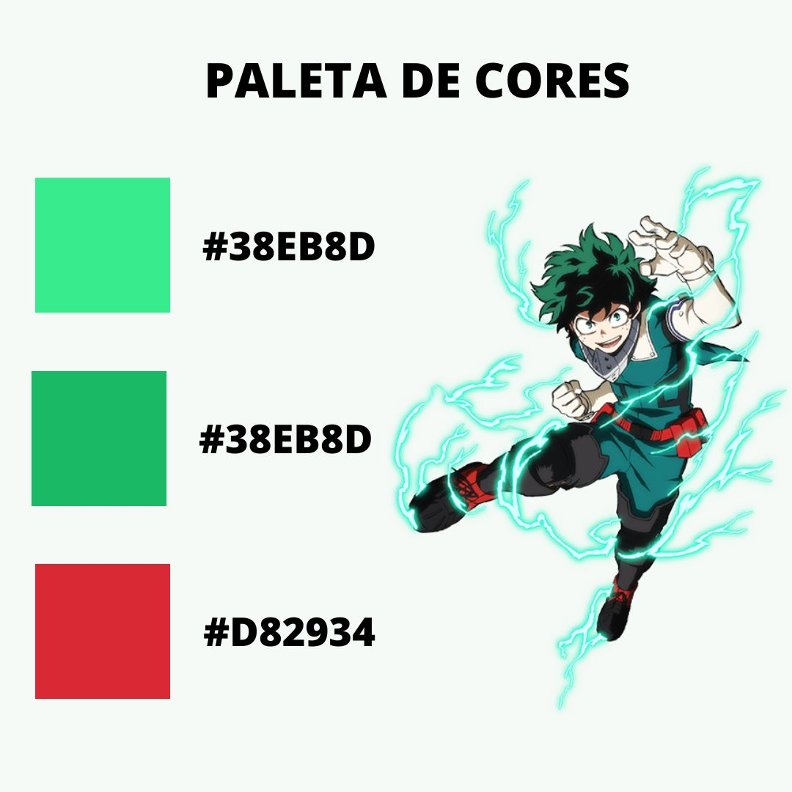
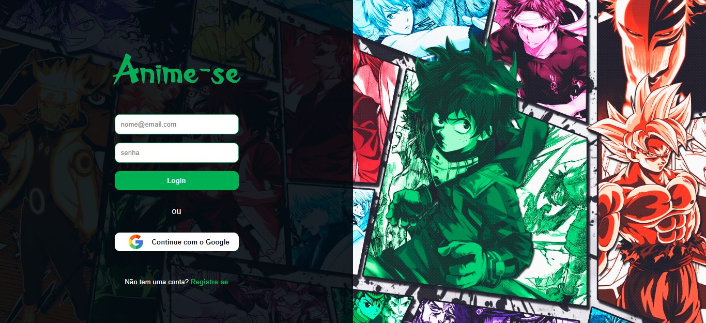
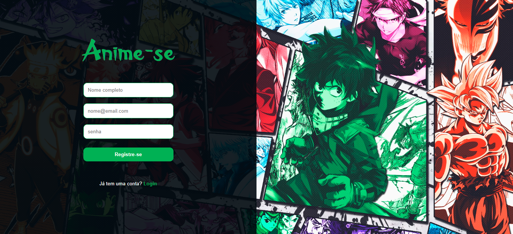
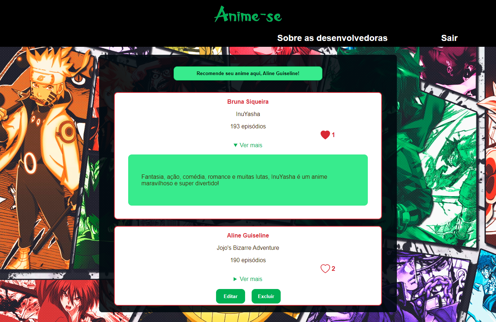
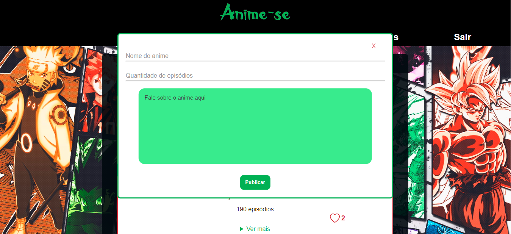

 
 
Gosta de animes e gostaria de receber algumas recomendações só com as informações essenciais? Fica desconfiada(o/e) quando vê algum influenciador ou blogueiro falando sobre algum anime, porque você não tem certeza se essa pessoa está sendo patrocinada ou não? Você também fica completamente perdida(o/e) quando vê que, só nessa temporada, foram lançados 2 milhões de animes e você não faz ideia do que as pessoas estão achando deles? Então Anime-se, porque o nosso terceiro projeto criado junto ao bootcamp da Laboratória foi feito para você!

## Índice

* [1. Resumo do projeto](#1-resumo-do-projeto)
* [2. Definição do produto](#2-definição-do-produto)
* [3. Histórias de usuários](#3-histórias-de-usuários)
* [4. Protótipo de baixa fidelidade](#4-protótipo-de-baixa-fidelidade)
* [5. Protótipo de alta fidelidade](#5-protótipo-de-alta-fidelidade)
* [6. Interface](#6-interface)
* [7. Testes de usabilidade](#7-testes-de-usabilidade)
* [8. Considerações técnicas](#8-considerações-técnicas)
* [9. Objetivos alcançados](#9-objetivos-alcançados)
* [10. Contatos](#10-contatos)

***

## 1. Resumo do projeto

O objetivo desse projeto foi construir uma rede social sobre um tema de escolha das desenvolvedoras. 

A rede social tem que permitir a qualquer usuário criar uma conta de acesso, logar-se com ela, criar, editar, deletar e dar likes em publicações.

O objetivo principal de aprendizagem deste projeto é construir uma [Single-page
Application (SPA)](https://pt.wikipedia.org/wiki/Aplicativo_de_p%C3%A1gina_%C3%BAnica)
[_responsiva_](https://curriculum.laboratoria.la/pt/topics/css/02-responsive) na qual seja possível ler e escrever dados.

## 2. Definição do produto

As animações japonesas, popularmente conhecidas como anime, se tornaram um sucesso global e fazem parte da vida de muitas pessoas. A rede social é destinada aos fãs de anime, e tem como objetivo ser uma plataforma que permite os usuários indicarem e receberem indicações de diversos animes.

Tendo em vista o aumento no número de influenciadores voltados aos animes e à cultura asiática, bem como ao aumento de blogs filiados a grandes empresas de streaming, mostrou-se necessária uma rede de fãs para fãs, em que as opiniões sobre os animes não fossem influenciadas por publicações pagas ou espaços patrocinados por estas empresas.

Além disso, ter uma rede social de indicações torna a vida do usuário mais prática, pois são lançados muitos animes por temporada*, o que pode confundir o usuário devido às variadas opções. Unido a isso, está também o fato de que algumas dessas produções são de estúdios ou criadores menores, que podem não ter muita credibilidade entre o público em geral - ter a opinião imparcial de pessoas que gostaram dessas produções pode apresentar um novo leque de opções ao usuário.

*É comum que os animes sejam lançados em “lotes” a cada período sazonal (verão, outono, inverno, primavera).

## 3. Histórias de usuários

**História do usuário 1:** “Como usuária, quero me logar com meu e-mail e senha ou com a minha conta do Google”

* Na tela de login, colocar dois inputs, sendo um para o e-mail e o outro para a senha, adicionando um botão para fazer o login com as informações inseridas

* Abaixo do botão de login, adicionar um botão de login com o Google, que abrirá um pop-up para que a pessoa selecione a sua conta vinculada

**História do usuário 2:** “Como usuária, quero me cadastrar com meu e-mail e senha de minha escolha”

* Criar outra tela para o registro e colocar inputs para o nome do usuário, e-mail e senha

* Abaixo do botão de fazer o registro, adicionar um botão para retornar à página de login caso a pessoa já seja cadastrada e tenha chegado ali por acidente ou curiosidade

**História do usuário 3:** “Como usuária, quero poder fazer posts”

* Criar uma página para a timeline e nela adicionar um botão que convide o usuário a criar um post (“Recomende o seu anime aqui”)

* Criar um modal que seja ativado quando a pessoa clicar nesse botão

* No modal, criar inputs para inserir o nome do anime e a quantidade de episódios e uma área de texto para digitar o post (indicação do anime)

**História do usuário 4:** “Como usuária, quero poder editar e excluir minhas publicações”

* Criar um botão para editar o post e outro para excluí-lo

* Posicionar estes botões dentro da área da postagem realizada pela pessoa que está logada

* Caso a pessoa clique no botão de editar, abrir o mesmo modal que ela viu quando criou o post, mas todos os campos já estarão preenchidos com as informações que ela colocou

**História do usuário 5:** “Em uma rede social quero poder curtir e descurtir as publicações”

* Dentro da área da postagem, colocar um coração que fique vazio se não tiver uma curtida da pessoa que está logada e fique preenchido na cor vermelha caso a pessoa curta (e volte a ficar vazio caso a pessoa retire a curtida)

* Ao lado deste coração, adicionar um contador para mostrar quantas curtidas o post tem

**História do usuário 6:** “Como usuária gostaria de acessar a rede social tanto pelo meu celular quanto pelo meu computador”

* Tornar o site responsivo para telas maiores

**História do usuário 7:** “Como usuária, quero conhecer mais sobre as desenvolvedoras do Anime-se”

* Criar uma página com os nossos nomes, um pequeno texto sobre a nossa relação com os animes, nossos links de contato (LinkedIn e GitHub) e as nossas recomendações de animes

## 4. Protótipo de baixa fidelidade
Criado no Canva, o protótipo de baixa fidelidade serviu como um bom guia, sendo seguido, praticamente, à risca.

  
Baixa fidelidade

  
 
  

## 5. Protótipo de alta fidelidade
O protótipo de alta fidelidade foi criado no Figma e completou, em design e funções, o de baixa fidelidade. No entanto, ao longo do desenvolvimento do projeto e devido aos testes de usabilidade realizados, algumas alterações mostraram-se necessárias.

  
Login (mobile)

 
  

  
Registro (mobile)

 

  
Timeline (mobile)

 

 

  
Post com botões de editar e excluir e post mostrando a descrição

 

  
Modal para criar o post

 

  
Menu aberto

 

  
Visão total dos posts criados pelo usuário

 

  
Sobre as desenvolvedoras

 

  
Sobre as desenvolvedoras - recomendações à mostra

 

  
Página de registro para desktop

 

  
Timeline para desktop

 

  
Página “Sobre as desenvolvedoras” para desktop

 

  
Recomendações de animes das desenvolvedoras - desktop

 

## 6. Interface

*Paleta de cores:* uso de cores que “conversavam” com aquelas presentes no background, para evitar um contraste negativo.

  
Paleta de cores

 

*Tela de login:* simples e intuitiva, somente com as informações necessárias.

  
Tela de login

 

*Tela de registro:* mesmo design da tela de login para que não haja estranhamento entre na navegação entre as páginas (evitar a sensação de que o usuário entrou em outro site).

  
Tela de registro

 

*Timeline:* uso de formas arredondadas para gerar a sensação de conforto e convidar o usuário a permanecer o máximo de tempo possível no site; informações condensadas para evitar a poluição visual.

  
Timeline

 

*Modal:* a fim de evitar a sobrecarga de informações na tela, optamos por utilizar o modal para que o usuário se sentisse mais livre para poder escrever o quanto quisesse.

  
Modal

 

*Sobre as desenvolvedoras:* design semelhante ao da timeline para reforçar a conexão entre as páginas; pequeno texto sobre as desenvolvedoras, enfatizando suas relações pessoais com os animes.

  
Sobre as desenvolvedoras

 

## 7. Testes de usabilidade

Utilizamos alguns usuários-testes para que eles pudessem dar as suas opiniões a respeito do projeto e realizamos consultas constantes com eles. A primeira foi após o desenvolvimento do protótipo, para que eles pudessem opinar sobre o design e o quão intuitivas eram as funcionalidades. Durante o desenvolvimento do projeto, consultamos-os novamente após a conclusão de cada história de usuário para que pudessem avaliar, de perto, se estavam condizentes com a proposta. Por fim, após o projeto estar concluído e já disponível para acesso, solicitamos que avaliassem-no pela última vez, agora para que pudessem ter a experiência completa.

Ao longo destes testes, os usuários sugeriram algumas mudanças que, após análise, nós concordamos e fizemos a atualização no projeto:
Inicialmente, planejamos criar uma página para falarmos sobre nós, desenvolvedoras, e outra para exibirmos as nossas indicações de animes, mas os usuários apontaram que poderia ficar um pouco desconexo separar estas duas áreas e sugeriram que colocássemos ambas as informações em uma única página;
Planejamos que o nome da pessoa conectada seria exibido no topo da página, com o trocadilho “Anime-se, {nome do usuário}”. Apesar de gostarem do trocadilho, os usuários acharam que seria melhor colocarmos a logo do site no cabeçalho, ao invés de simplesmente escrever “Anime-se”, para fixar a nossa identidade junto ao usuário. Diante desta sugestão, decidimos colocar o nome do usuário no botão de recomendação de anime, junto da frase “Recomende seu anime aqui”, para instigá-lo a postar e gerar uma conexão entre a página e ele.
Na página de cadastro, abaixo dos campos para inserir o e-mail e a senha nós colocamos, também, campos para repetir estas informações, mas, ao preenchê-las os usuários se queixaram deste excesso de demanda ser cansativo, sobretudo para um site cujo objetivo era relaxar e se distrair. A partir deste feedback, optamos por deixar a tela de registro mais enxuta, pedindo somente por nome, e-mail e senha.

## 8. Considerações técnicas

Linguagens utilizadas: JavaScript | HTML5 | CSS3
Programas/Plataformas utilizadas: VSCode (codificação) | Firebase (registro de novas contas e autenticação de usuários) | Firestore (criação, exibição, edição e exclusão de posts) | Canva (protótipo de baixa fidelidade e imagem com a paleta de cores) | Vite (ferramenta de compilação) | Figma (protótipo de alta fidelidade) | Trello (planejamento)

## 9. Objetivos alcançados

✨ Desenvolvimento de uma plataforma que permita ao usuário registrar uma nova conta, logar em uma conta já existente (com e-mail e senha informados ou através da conta do Google), criar, editar, excluir, curtir e descurtir posts.
✨ Criação de histórias de usuário e construção do site de acordo com estas histórias
✨ Desenvolvimento do projeto de acordo com os testes de usabilidade realizados com usuários reais
✨ Cobertura de 100% nos testes unitários
✨ Páginas 100% responsivas
✨ Criação e validação de testes unitários para as funções criadas no código

## 10. Contatos

**Aline Guiseline** 💙

https://www.linkedin.com/in/alineguiseline/
https://github.com/AlineGuiseline/

**Bruna Abreu** 💙

https://www.linkedin.com/in/bru-abreu/
https://github.com/bruna-abreu
